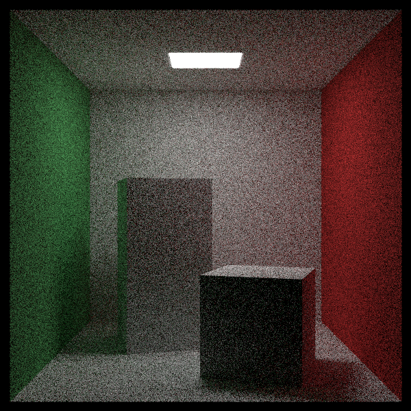
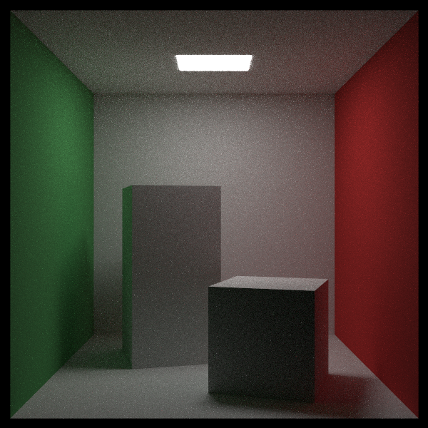

# raytrace

A Haskell library for rendering images using path tracing. Inspired by the book series [Ray Tracing in One Weekend](https://raytracing.github.io/) by Peter Shirley and Steve Hollasch.

[View on Hackage](https://hackage.haskell.org/package/raytrace)

Features:
* Spheres, parallelograms, and boxes
* Triangle meshes (with a parser for .obj files)
* Volumes (fog, subsurface scattering)
* A variety of materials, with behaviors including light emission and refraction (you can define additional materials in Haskell)
* Texture mapping
* Perlin noise for procedurally generated textures
* Parallel computation of pixels (if you compile your program with the flags `-threaded -rtsopts -with-rtsopts=-N`)
* Bounding volume hierarchies
* The ability to prioritize light sources when choosing a scattered ray direction, leading to faster convergence without sacrificing accuracy (see the section "Ray Redirection" below)
* Transformed instances
* Motion blur
* Optional defocusing to simulate a real camera lens


The image above, with 405 million top-level rays, was generated on my laptop in about 8 minutes. The blurriness in the foreground and background is due to defocusing, wherein only a single plane is in focus. The following image demonstrates texture mapping, light sources, motion blur, and fog. (The code for both of these images was based on code in the aforementioned books.)


Here is an image demonstrating polygonal meshes and subsurface scattering:


## Example Code

```haskell
module Main where

import Graphics.Ray
import Linear (V3(V3))
import System.Random (newStdGen)
import Data.Functor.Identity (Identity)

world :: Geometry Identity Material
world = group
  [ lambertian (checkerTexture 20 10 0.2 0.8) <$ sphere (V3 0 0 0) 1
  , lambertian (constantTexture (V3 0 0.2 0.5)) <$ sphere (V3 0 (-1000) 0) 999
  , mirror (constantTexture 0.8) <$ parallelogram (V3 (-3.25) (-1) (-0.75)) (V3 1.25 0 (-1.25)) (V3 0 2 0)
  ]

settings :: CameraSettings
settings = defaultCameraSettings
  { cs_center = V3 (-0.75) 0 2
  , cs_lookAt = V3 0 0 (-1)
  , cs_aspectRatio = 16 / 9
  , cs_imageWidth = 600
  , cs_samplesPerPixel = 50
  }

main :: IO ()
main = do
  seed <- newStdGen
  writeImage "example_image.png" (raytrace settings world seed)
```

This produces the following image:


## Ray Redirection

For scenes with small light sources, the basic path tracing algorithm can result in very noisy images, as most rays never reach a light source. To reduce the noise, we can alter the distribution of scattered ray directions, increasing the probability of sending a ray toward a light source and decreasing the probability of other directions. This sounds like it would bias the result and make surfaces appear brighter than they should, but we can correct for that by weighting the resulting colors, downweighting directions that we have made more common and upweighting directions that we have made less common. The mathematical basis for this is known as [https://en.wikipedia.org/wiki/Monte_Carlo_integration](Monte Carlo integration), specifically the "importance sampling" method.

Here is an example using the [Cornell Box](https://en.wikipedia.org/wiki/Cornell_box). The first image was generated with `cs_redirectTargets = []` (the default), and the second with `cs_redirectTargets = [ (0.25, V3 343 554 332, V3 (-130) 0 0, V3 0 0 (-105)) ]`. (This means that 25% of scattered rays are sent toward a random point on the parallelogram defined by the three vectors, which happens to be the light source.) Both images were generated with the same number of samples per pixel (200), but the second image is much less noisy. It also took half as long to render due to rays terminating at the light sooner.





Of course, the second image still has some noise, which could be reduced by increasing the number of samples per pixel.