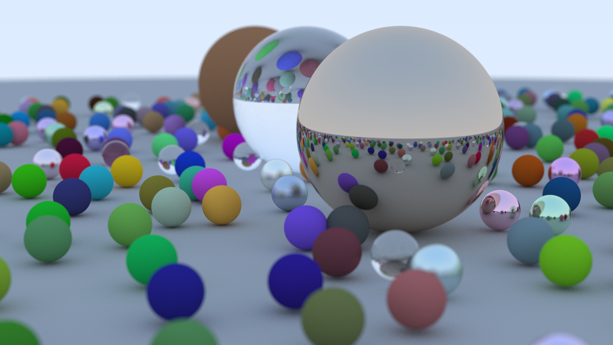

# Ray Tracing

Ray tracers in C++ and Haskell based on the books [Ray Tracing in One Weekend](https://raytracing.github.io//books/RayTracingInOneWeekend.html) and [Ray Tracing: The Next Week](https://raytracing.github.io//books/RayTracingTheNextWeek.html) by Peter Shirley. 

The image above, with 405 million rays, was generated by the Haskell ray tracer in about 8 minutes. (The blurriness in the foreground and the background is intentional.)