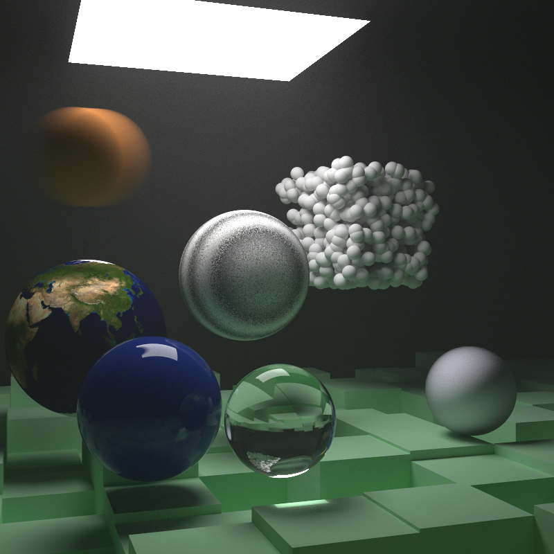

# raytrace

A Haskell ray tracing library. Largely based on the books [Ray Tracing in One Weekend](https://raytracing.github.io/books/RayTracingInOneWeekend.html) and [Ray Tracing: The Next Week](https://raytracing.github.io/books/RayTracingTheNextWeek.html) by Peter Shirley.

Features:
* Spheres, parallelograms, and boxes (you can define your own shapes in addition to these)
* Volumes (fog and the like)
* A variety of materials, with behaviors including light emission and refraction
* Texture mapping
* Perlin noise for procedurally generated textures
* Parallel computation of pixels
* Bounding volume hierarchies
* Affine transformations (rotation, translation, and so on)
* Optional defocusing to imitate a real camera

Possible future additions:
* Motion blur
* Triangular meshes
* ???


The image above, with 405 million top-level rays, was generated on my laptop in about 8 minutes.



## Example Usage

```
import Graphics.Ray

world = group
  [ lambertian <$ sphere (V3 0 0 0) 1
  , lambertian <$ sphere (V3 0 (-1000) 0) 999
  , mirror (constantTexture 1) <$ parallelogram
  ]

settings = defaultCameraSettings
  {

  }

main :: IO ()
main = writeImage "test_image.png" <$> raytrace settings world
```